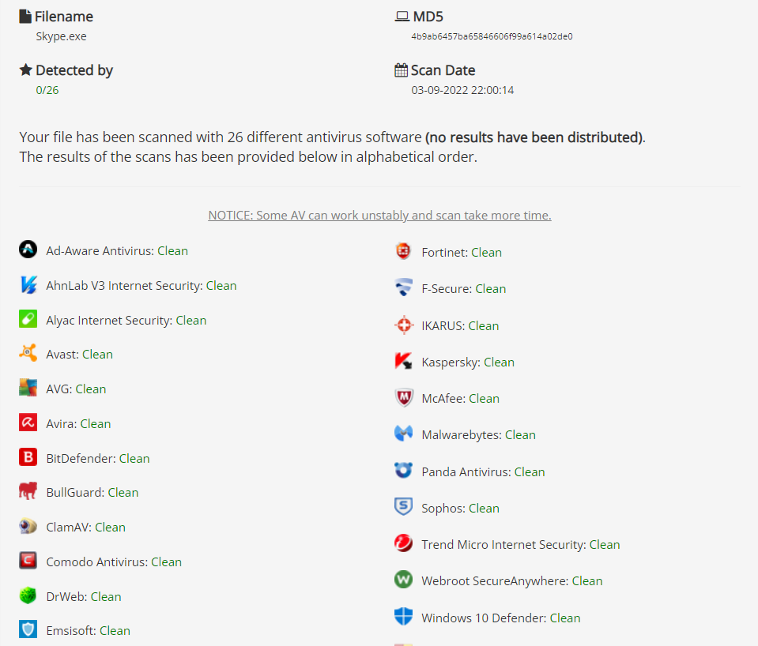
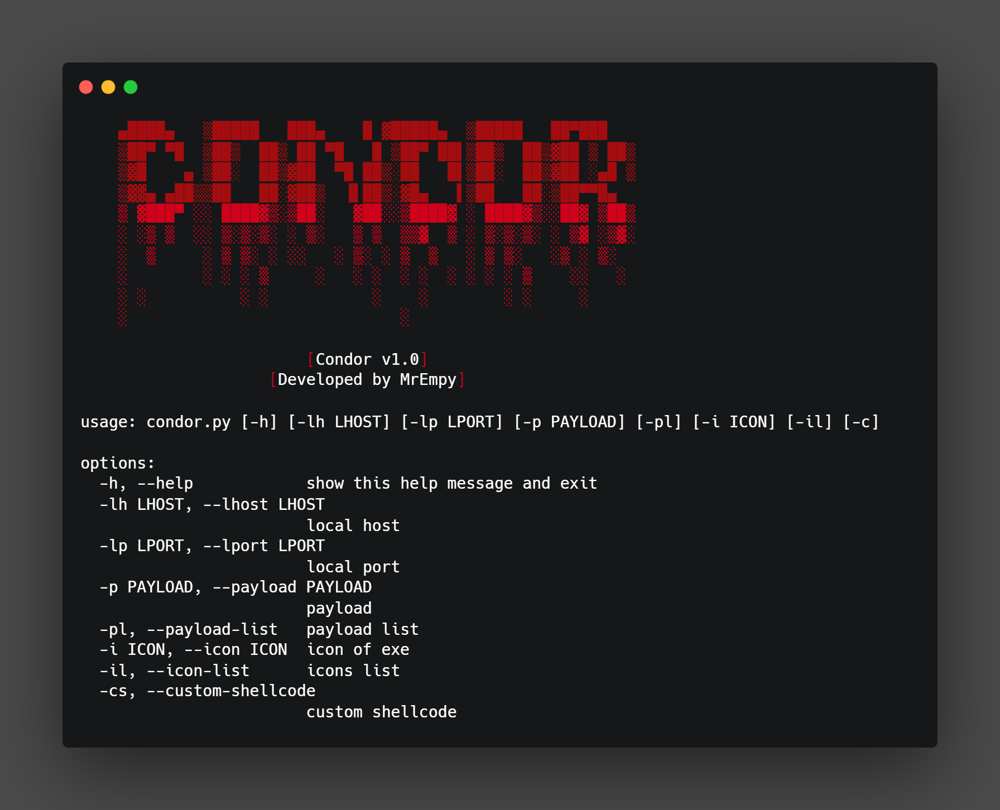

<h1 align="center">「🛡️」About Condor</h1>

<p align="center"></p>

<p align="center">Condor is a tool created to help pentesters bypass protections such as AVs/EDRs/XDRs in operating systems. Condor was developed in Python and has several advantages to help pentesters.</p>

## Executable Scan



## Benefits

* Easy to use
* Bypass most AVs/EDRs/XDRs
* The generated file is less than 7mb
* Using custom shellcode
* Fake signature on executable

## Environment support

| OS/Subsystem |  | Installation of All Requirements | Compilation | EXE Execution |
| ----------- | ----------- | ----------- | ----------- | ----------- |
| Windows | ❌ | ✅ | ✅ | ✅ |
| Linux | ✅ | ❌ | ❌ | ❌ |
| Mac | not tested | not tested | not tested | not tested |
| WSL | ✅ | ✅ | ✅ | ✅ |

It is recommended to run the tool in a WSL environment, as you will need to generate shellcodes using msfvenom and compile to EXE using pyinstaller.

## Help




## Usage

```
$ git clone https://github.com/MrEmpy/Condor.git
$ cd Condor
$ chmod +x install.sh
$ sudo ./install.sh
```
